---

# 🚀 Node.js Application Deployment on Kubernetes with a DevSecOps GitLab CI/CD Pipeline

  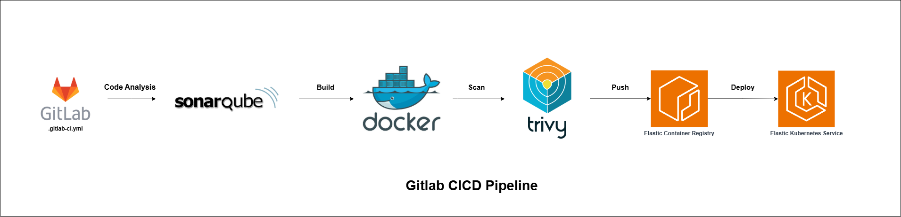

This project showcases the complete deployment of a Node.js application to an EKS (Elastic Kubernetes Service) cluster using GitLab CI/CD pipelines. It integrates DevSecOps practices by including **SonarQube** for static code analysis and **Trivy** for container vulnerability scanning.

---

## 📌 Project Highlights

- 🐳 GitLab CI/CD for automation
- 🛡️ SonarQube for static code quality checks
- 🔐 Trivy for vulnerability scanning of Docker images
- ☁️ AWS EKS for Kubernetes cluster
- 📦 Amazon ECR for container image registry
- ⚙️ GitLab Runner setup (both Docker and Kubernetes)

---

## 🛠️ Step-by-Step Implementation

---

### ✅ Step 1 - Setup Sonarqube Server for Static Code Analysis

- Spin up the Sonarqube Server

  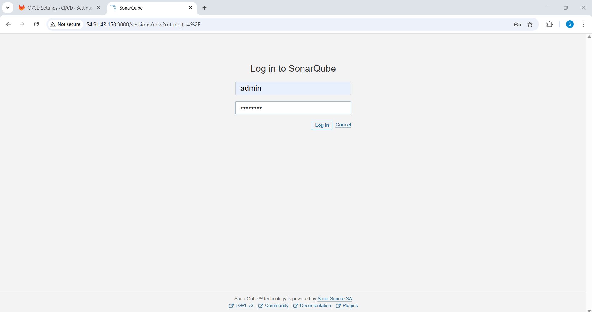

- Create SonarQube token to be used in GitLab as a variable

  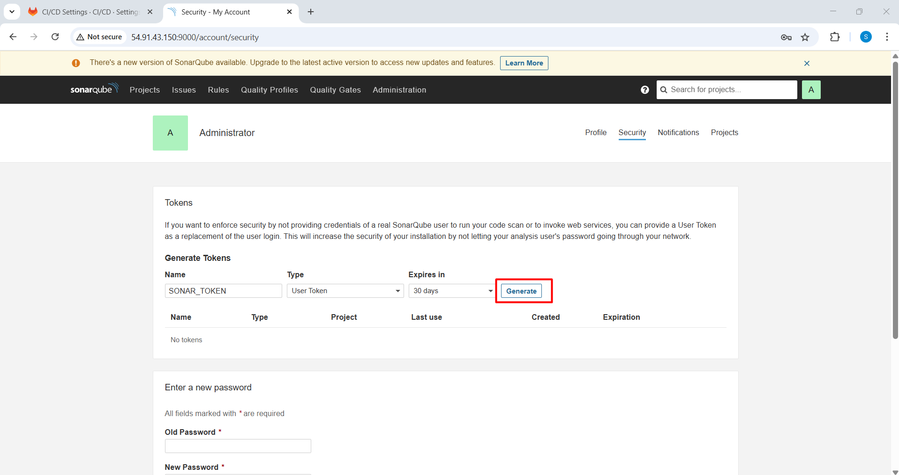

---

### ✅ Step 2 - Create EKS Cluster using a Bootstrap Server

#### Install AWS CLI

```bash
curl "https://awscli.amazonaws.com/awscli-exe-linux-x86_64.zip" -o "awscliv2.zip"
unzip awscliv2.zip
sudo ./aws/install
```

#### Install Kubectl

```bash
curl -O https://s3.us-west-2.amazonaws.com/amazon-eks/1.26.4/2023-05-11/bin/linux/amd64/kubectl
chmod +x kubectl
mv kubectl /usr/local/bin/
kubectl version
```

#### Install Eksctl

```bash
curl --silent --location "https://github.com/weaveworks/eksctl/releases/latest/download/eksctl_$(uname -s)_amd64.tar.gz" | tar xz -C /tmp
sudo mv /tmp/eksctl /usr/local/bin
eksctl version
```

#### Attach IAM Role

Create a role named `eksctl\role` and attach it to the bootstrap EC2 server.

#### Create an EKS Cluster

```bash
eksctl create cluster --name my-eks-cluster --region us-east-1 --node-type t2.medium --nodes 2
```

#### Install Helm

```bash
curl -fsSL -o get_helm.sh https://raw.githubusercontent.com/helm/helm/main/scripts/get-helm-3
chmod 700 get_helm.sh
./get_helm.sh
```

#### Install AWS Load Balancer Controller

> ✅ Note:
> - Attach IAM role to worker nodes with EC2 and ELB access
> - Update `ingress.yaml` with ACM Certificate ARN

```bash
helm repo add eks https://aws.github.io/eks-charts
helm repo update
helm install aws-load-balancer-controller eks/aws-load-balancer-controller \
    --set clusterName=<your-cluster-name> \
    --set serviceAccount.create=true \
    --set serviceAccount.name=aws-load-balancer-controller \
    --namespace kube-system
kubectl get pods -n kube-system | grep aws-load-balancer-controller
```

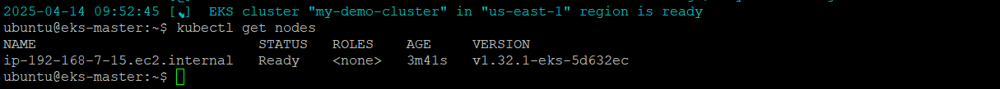

---

### ✅ Step 3: Setup ECR Repository

- Setup ECR repo for pushing Docker images  
  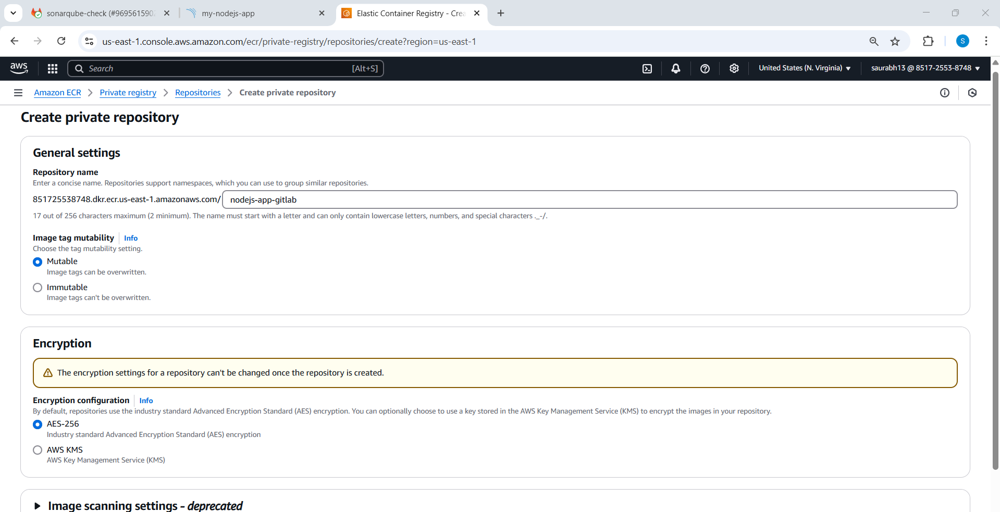

- Update image URL in K8s deployment file  
  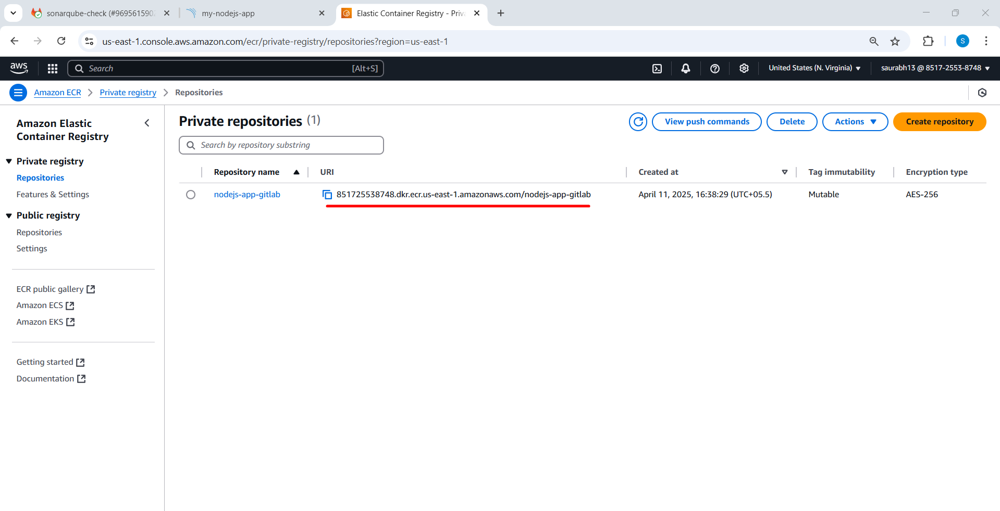

---

### ✅ Step 4: Create a GitLab Project

- Create a project and push changes  
  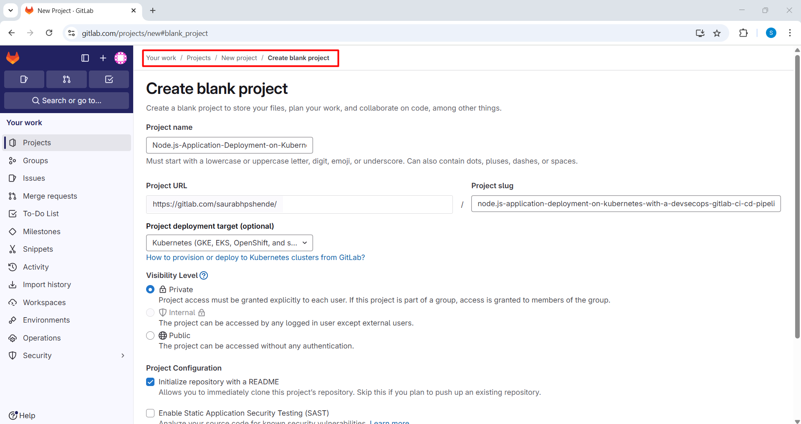  
  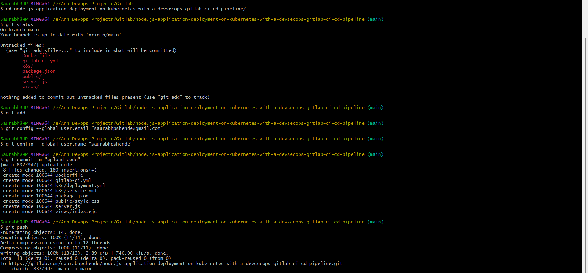  
  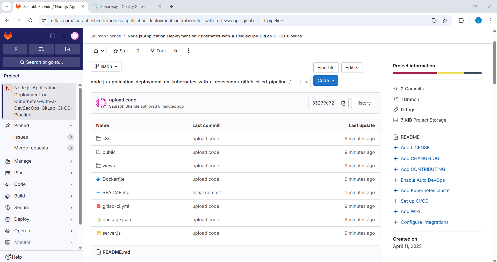

- Create a self-hosted runner (docker-runner) on EC2  
  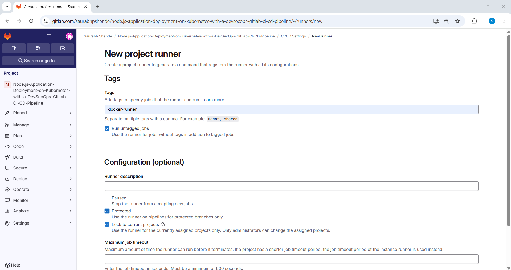  
  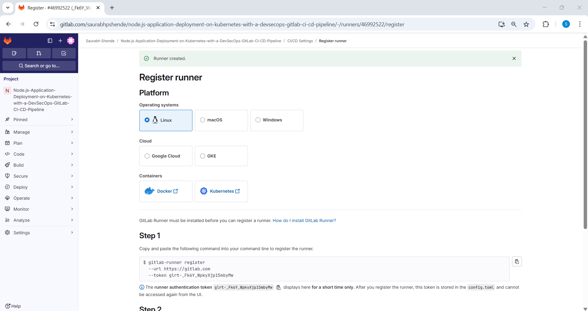

#### On EC2:

```bash
sudo curl -L --output /usr/local/bin/gitlab-runner "https://s3.dualstack.us-east-1.amazonaws.com/gitlab-runner-downloads/latest/binaries/gitlab-runner-linux-amd64"
sudo chmod +x /usr/local/bin/gitlab-runner
sudo useradd --comment 'GitLab Runner' --create-home gitlab-runner --shell /bin/bash
sudo gitlab-runner install --user=gitlab-runner --working-directory=/home/gitlab-runner
sudo gitlab-runner start
gitlab-runner register  --url https://gitlab.com  --token <tokenid>
```

> Choose `docker` as the executor

---

### ✅ Step 5 - Create GitLab CI/CD Variables

Navigate to: **GitLab → Settings → CI/CD → Variables**

| Variable Name         | Description                                 |
|----------------------|---------------------------------------------|
| AWS_ACCESS_KEY_ID    | Your AWS access key                         |
| AWS_SECRET_ACCESS_KEY| Your AWS secret key                         |
| AWS_REGION           | AWS region where ECR is located             |
| ECR_REPOSITORY_URI   | ECR URI (e.g., 1234.dkr.ecr.us-east-1...)   |
| SONAR_PROJECT_KEY    | SonarQube project key                       |
| SONAR_HOST_URL       | SonarQube server URL                        |
| SONAR_TOKEN          | SonarQube authentication token              |

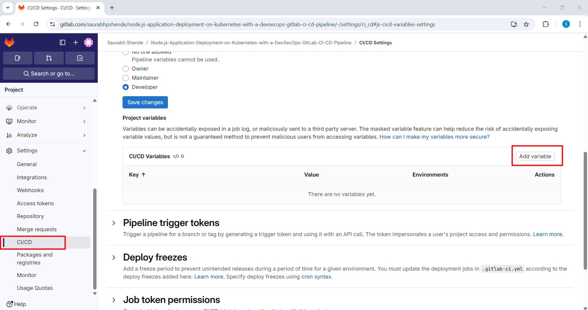  
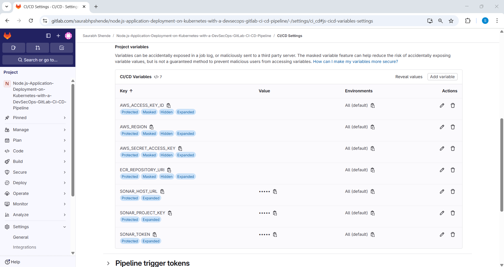

---

### ✅ Step 6 - Create K8s Runner & GitLab Kubernetes Integration

- Create GitLab Kubernetes runners using GitLab Agent

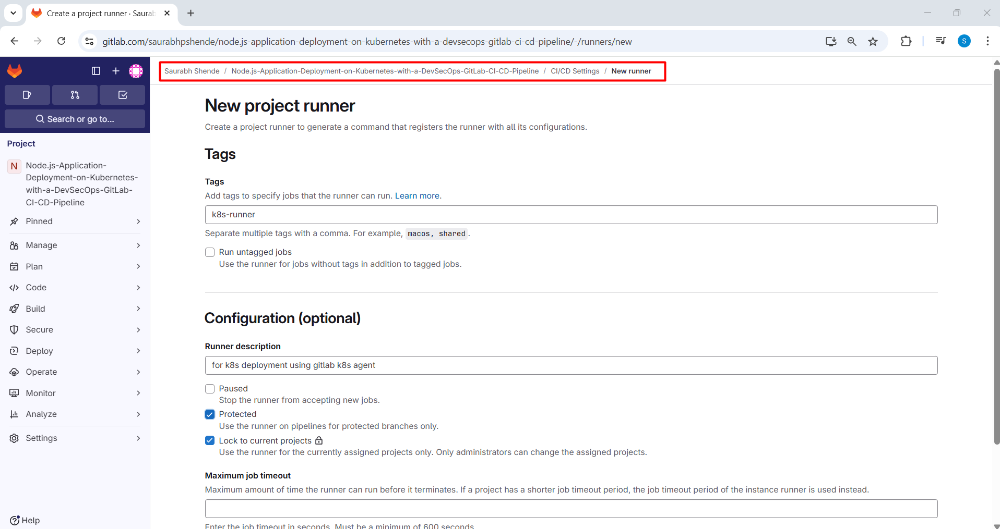  
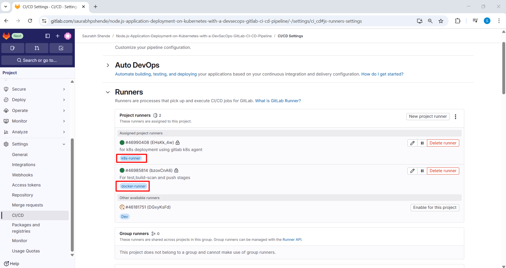

#### On EKS Master:

```bash
kubectl create namespace gitlab-runner
kubectl config set-context --current --namespace=gitlab-runner
helm repo add gitlab http://charts.gitlab.io/
```

- Create `values.yaml` and configure agent

```yaml
gitlabUrl: https://gitlab.com
runnerToken: <your-runner-token>
...
```

- Install runner via Helm:

```bash
helm install -f values.yaml gitlab-runner gitlab/gitlab-runner
```

- Apply RBAC configs:

```bash
kubectl config set-context --current --namespace=default
kubectl apply -f clusterrole.yaml
kubectl apply -f clusterrole-binding.yaml
```

- Register GitLab Agent:

```bash
helm upgrade --install dev gitlab/gitlab-agent \
  --namespace gitlab-agent-prod \
  --create-namespace \
  --set config.token=<agent-token> \
  --set config.kasAddress=wss://kas.gitlab.com
```

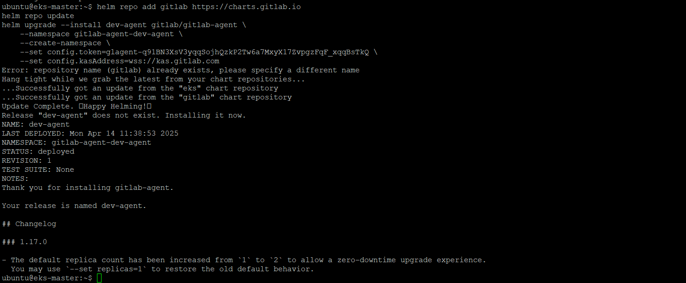  
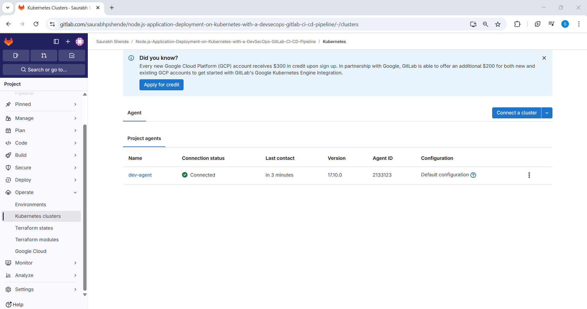

- Update `.gitlab/agents/dev-agent/config.yaml`

```yaml
user_access:
  access_as:
    agent: {}
  projects:
    - id: saurabhpshende/Node.js-Application-Deployment-on-Kubernetes-with-a-DevSecOps-GitLab-CI-CD-Pipeline
```

- Add environment in GitLab UI

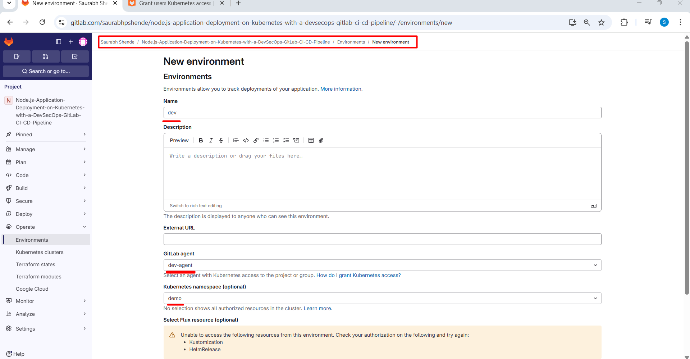

---

### ✅ Step 7 - Create `.gitlab-ci.yml` Pipeline

```yaml
stages:
  - test
  - build-scan
  - push
  - deploy

variables:
  IMAGE_TAG: $ECR_REPOSITORY_URI:latest
```

#### SonarQube Test

```yaml
test:
  stage: test
  image: sonarsource/sonar-scanner-cli:latest
  tags:
    - docker-runner
  script:
    - sonar-scanner -Dsonar.projectKey=$SONAR_PROJECT_KEY -Dsonar.host.url=$SONAR_HOST_URL -Dsonar.login=$SONAR_TOKEN
  only:
    - main
```

#### Build + Trivy Scan

```yaml
build-scan:
  stage: build-scan
  tags:
    - docker-runner
  before_script:
    - apk add --no-cache curl tar
    - curl -LO https://github.com/aquasecurity/trivy/releases/download/v0.49.1/trivy_0.49.1_Linux-64bit.tar.gz
    - tar zxvf trivy_0.49.1_Linux-64bit.tar.gz
    - mv trivy /usr/local/bin/
  script:
    - docker build -t $IMAGE_TAG .
    - docker save -o image.tar $IMAGE_TAG
    - trivy image --format table --exit-code 0 --severity HIGH,CRITICAL $IMAGE_TAG
    - mkdir -p trivy
    - trivy image --format template --template "@contrib/html.tpl" --output trivy/trivy-report.html $IMAGE_TAG
  artifacts:
    paths:
      - image.tar
      - trivy/trivy-report.html
    expire_in: 1 hour
  only:
    - main
```

#### Push to ECR

```yaml
push:
  stage: push
  image: docker:latest
  tags:
    - docker-runner
  dependencies:
    - build-scan
  before_script:
    - apk add --no-cache curl unzip python3 py3-pip aws-cli
    - docker load -i image.tar
    - aws configure set aws_access_key_id "$AWS_ACCESS_KEY_ID"
    - aws configure set aws_secret_access_key "$AWS_SECRET_ACCESS_KEY"
    - aws configure set region "$AWS_REGION"
    - aws ecr get-login-password --region "$AWS_REGION" | docker login --username AWS --password-stdin "$ECR_REPOSITORY_URI"
  script:
    - docker push $IMAGE_TAG
  only:
    - main
```

#### Deploy to EKS

```yaml
deploy:
  stage: deploy
  image:
    name: bitnami/kubectl:latest
    entrypoint: [""]
  tags:
    - k8s-runner
  script:
    - kubectl apply -f k8s/
    - kubectl get all
  environment:
    name: dev
  only:
    - main
```

---

### ✅ Step 8 - Verify the Pipeline and Deployment

- ✅ Pipeline Status  
  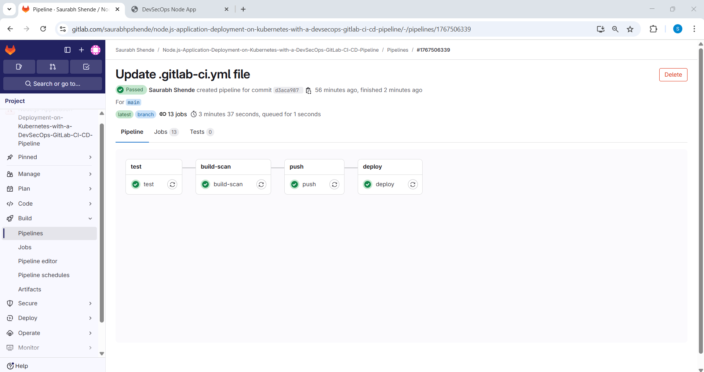

- 🧪 SonarQube Static Analysis  
  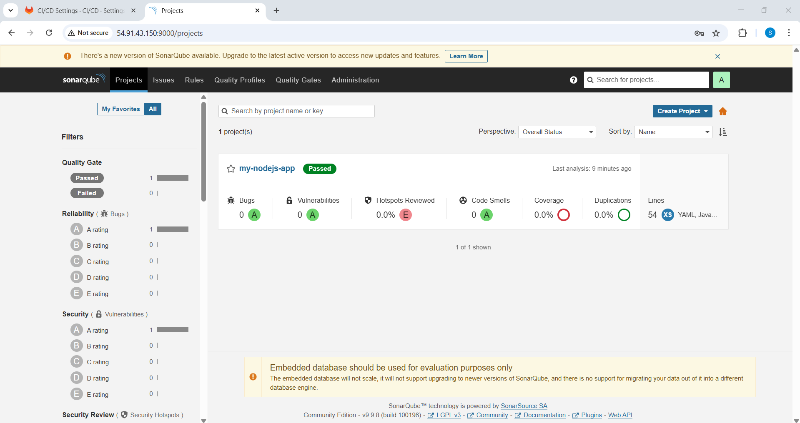

- 🛡️ Trivy Scan Report  
  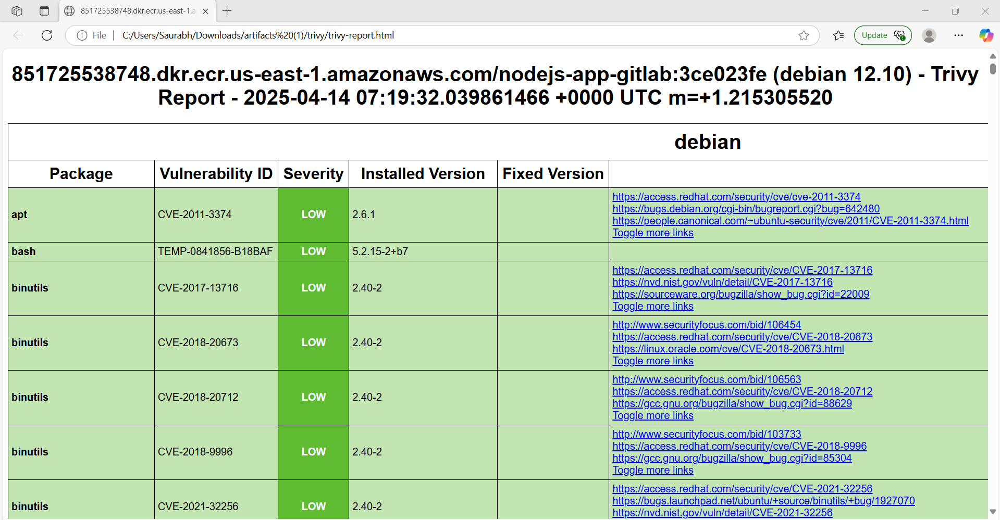

- 🚀 Final App Deployment on EKS  
  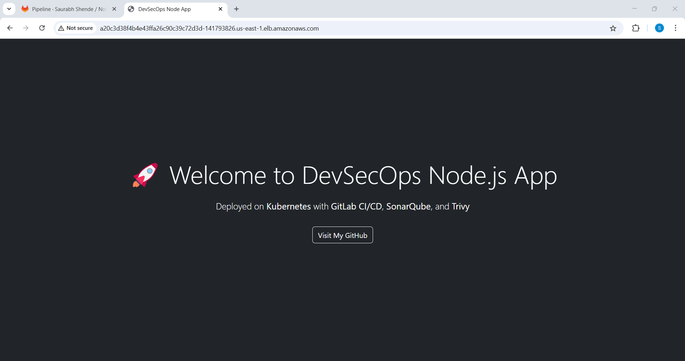

---

## 📁 Project Structure Suggestion

```
.
├── k8s/
│   ├── deployment.yaml
│   ├── service.yaml
│   └── ingress.yaml
├── .gitlab-ci.yml
├── Dockerfile
├── app/
│   └── index.js
├── steps/
│   └── [screenshots]
└── .gitlab/agents/dev-agent/config.yaml
```

---
